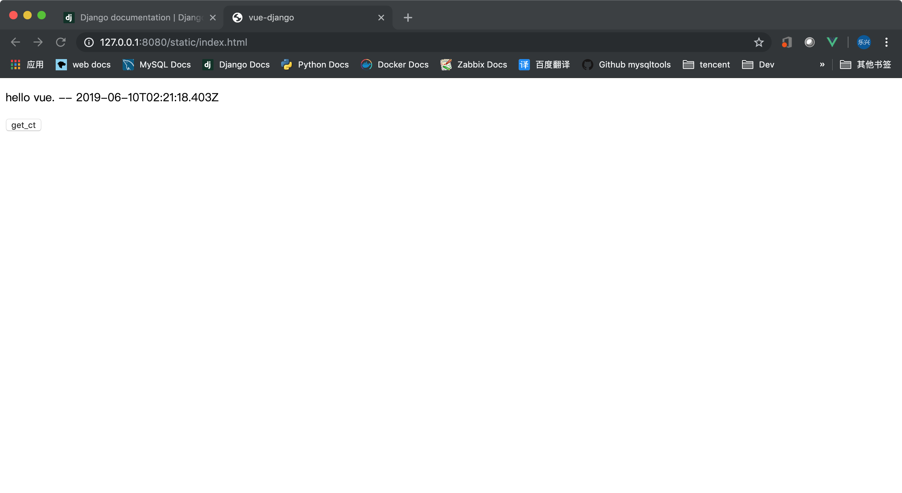

## 目录
- [vuedjango](#vuedjango)
- [解决办法](#解决办法)
- [前端部分](#前端部分)
- [全局url路由](#全局url路由)
- [效果](#效果)

---

## vuedjango
   **vuedjango 主要是想做为一个 demo ，为了探索前后端分离后，项目怎样组织才比较优雅**

   ---

## 解决办法
   **1、把整个前端部分看做是静态文件**

   **2、定义一个全局的重定向视图，把对“/”的访问重定向到 vue**

   ---

## 前端部分
   **static/index.html**
   ```html
<!DOCTYPE html>
<html>
    <head>
        <title>
            vue-django
        </title>
        <script src="https://cdn.jsdelivr.net/npm/axios@0.12.0/dist/axios.min.js"></script>
        <script src="https://cdn.jsdelivr.net/npm/lodash@4.13.1/lodash.min.js"></script>
        <script src="https://cdn.jsdelivr.net/npm/vue/dist/vue.js"></script>
        <meta charset="utf8">
    </head>

    <body>
        <div id="app">
            <p>{{ message }} -- {{ ct }}</p>
            <button v-on:click="get_ct();">get_ct</button>
        </div>
        <script>
            var app = new Vue({
                el: '#app',
                data: {
                    message: "hello vue.",
                    ct: '',
                },
                methods:{
                    get_ct: function(){
                        var vm = this;
                        axios({
                            method: 'POST',
                            url: '/foo/',
                            xsrfCookieName: 'csrftoken',
                            xsrfHeaderName: 'X-CSRFToken',
                        }).then(function(response){
                            // 通过异步请求刷新页面
                            vm.ct = response.data.ct;
                        })
                    }
                }
            })
        </script>
    </body>
</html>
   ```

   ---

## 全局url路由
   ```python
   from django.contrib import admin
   from django.urls import path,include
   from django.http.response import HttpResponseRedirect,HttpResponsePermanentRedirect
   
   def router(request):
       return HttpResponsePermanentRedirect('/static/index.html')
   
   urlpatterns = [
       path('admin/', admin.site.urls),
       path('',router),
       path('foo/',include('apps.foo.urls'))
   ]
   ```

   ---

## 效果
   ```bash
   python3 manage.py runserver 127.0.0.1:8080
   Performing system checks...
   
   System check identified no issues (0 silenced).
   
   You have 15 unapplied migration(s). Your project may not work properly until you apply the migrations for    app(s): admin, auth, contenttypes, sessions.
   Run 'python manage.py migrate' to apply them.
   
   June 10, 2019 - 02:21:14
   Django version 2.1.7, using settings 'vuedjango.settings'
   Starting development server at http://127.0.0.1:8080/
   Quit the server with CONTROL-C.
   [10/Jun/2019 02:21:17] "GET /static/index.html HTTP/1.1" 304 0
   [10/Jun/2019 02:21:18] "POST /foo/ HTTP/1.1" 200 34
   ```
   

   ---